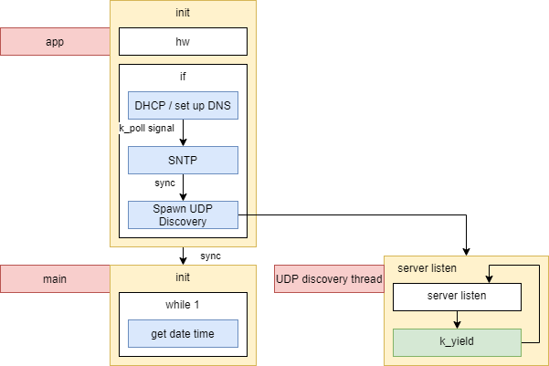
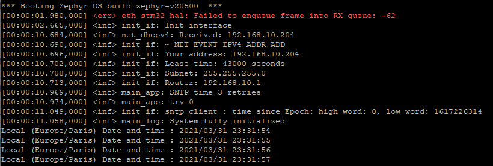
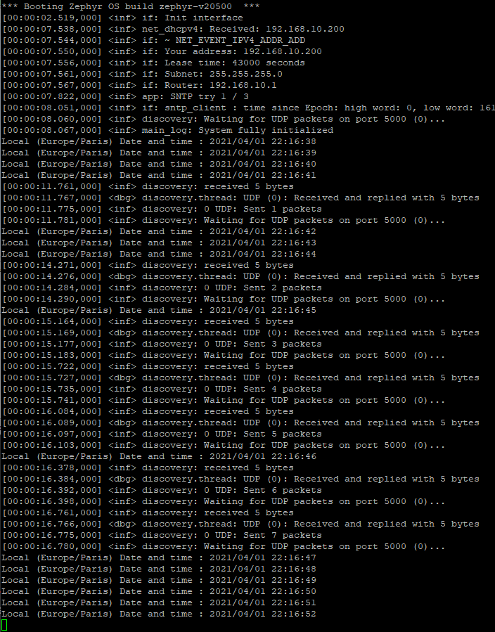
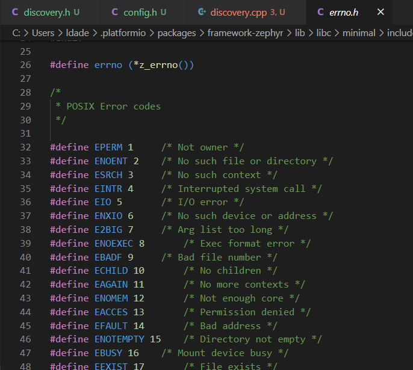

**this repo contains pictures and big O files, it is only a getting started project :)**

# Nucleo f429zi

Current system model



Log



UDP discovery - v1



# Questions, todo & Open Points

## Get the MAC addr (can we change it ?)

See how to get a static IP, does DHCP give a rdm IP or does the MAC addr change

- 02:80:e1:b4:be:77
- 02:80:e1:35:7e:07

MAC address seems to change (only the 3 last bytes).
The 3 first bytees stay the sames

We can fix theses values in the prj.conf file

```
CONFIG_ETH_STM32_HAL_RANDOM_MAC=n
CONFIG_ETH_STM32_HAL_MAC3=77
CONFIG_ETH_STM32_HAL_MAC4=77
CONFIG_ETH_STM32_HAL_MAC5=77
```

After mac address is not random anymore 

First 3 bytes changed in NOT RANDOM MAC mode (security ? lock ?)
```
00:80:e1:77:77:77
```

## Singleton - Design pattern

- Description : https://h-deb.clg.qc.ca/Sujets/Divers--cplusplus/CPP--Singletons.html
- Interesting article about Singleton for Embedded : https://www.embeddedrelated.com/showarticle/691.php
- Other article : https://lonkamikaze.github.io/2019/10/05/embedded-cxx-singletons

## Choose different port than 5000 (which is DNS port)

## UDP discovery, return ip, time, app name, version, and other stats

Python *scapy* library to test udp discovery : `from scapy.all import *` : `send(IP(dst="192.168.10.255")/UDP(dport=5000)/Raw(load="hello"))`

## make it more robust

## see how to use/create static variables & set class singleton, set port and other parameters

## file system fs_read / fs_write

## set time

## efficient way to handle errors



## k_work_init to sync tasks

- Workqueues : https://docs.zephyrproject.org/1.9.0/kernel/threads/workqueues.html

## Threading Zephyr

Zephyr Scheduling : Interesting and important : https://docs.zephyrproject.org/1.12.0/kernel/threads/scheduling.html
- Threading API : https://docs.zephyrproject.org/latest/reference/kernel/threads/index.html
- Scheduling API : https://docs.zephyrproject.org/latest/reference/kernel/scheduling/index.html

Polling API : https://docs.zephyrproject.org/1.9.0/kernel/other/polling.html

About `main` thread : https://docs.zephyrproject.org/1.12.0/kernel/threads/system_threads.html

# Info

## Link to : https://os.mbed.com/platforms/ST-Nucleo-F429ZI/

## DTS file - for hw.cpp
 
*.dts* file : `nucleo_f429zi.dts` located here : `.platformio\packages\framework-zephyr\boards\arm\nucleo_f429zi`

- *LED0*, *LED1*, *LED2* : leds *green*, *blue*, *red*
- *SW0* : user button

## .c -> .cpp

In order to use *.cpp* files rather than *.c* files, completely delete the *.pio* (build) directory.

## SNTP

Zephyr https://docs.zephyrproject.org/latest/reference/networking/sntp.html#group__sntp_1ga945936e5164bbd959cfa666ceacdac13

## Meaning of NET_EVENT_ETHERNET_CARRIER_ON & NET_EVENT_ETHERNET_CARRIER_OFF ?

## Zephyr Kernel API

https://docs.zephyrproject.org/1.9.0/api/kernel_api.html#_CPPv319k_delayed_work_initP14k_delayed_work16k_work_handler_t

## Zephyr minimal configuration

- for IoT
- 32 bits ?
- min 8kb on ram

Comparison Free RTOS & Zephyr RTOS & mbed os : https://www.reddit.com/r/embedded/comments/in7rjy/zephyr_vs_freertos_for_embedded_iot_project/

---

# Issues :

Find issues in the code by typing : `ISSUE 001` for example.

## 001. undefined reference to *net_config_init_app*
When disabling : `CONFIG_NET_CONFIG_AUTO_INIT=n`

And when we call manually `net_config_init_app(NULL, "app");` or `net_config_init("app", NET_CONFIG_NEED_IPV4, 1000);` the linker says `undefined reference to net_config_init`.

Even when including `#include <net/net_config.h>` and all the other headers : 

```
#include <net/net_if.h>
#include <net/net_core.h>
#include <net/net_context.h>
#include <net/net_mgmt.h>
```

Maybe cmake, missing binaries, configuration ?

Waiting, I'm setting `CONFIG_NET_CONFIG_AUTO_INIT=y` and don't calling these functions.

### 002. <err> os: CONFIG_MINIMAL_LIBC_MALLOC_ARENA_SIZE is 0

Need